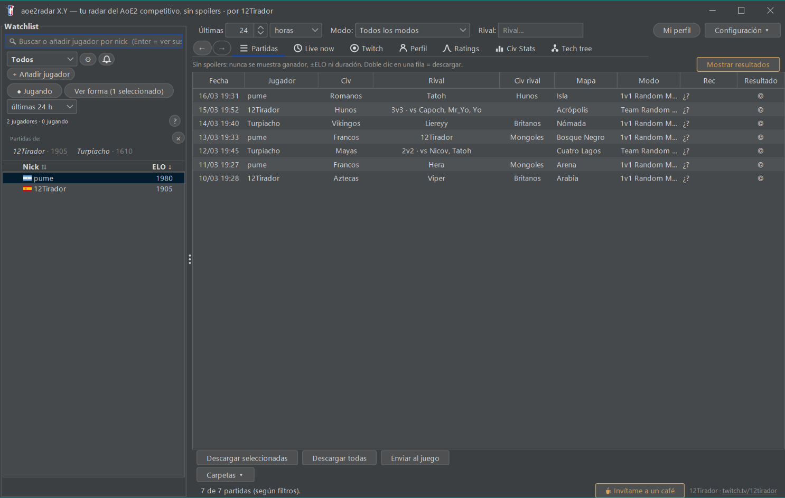
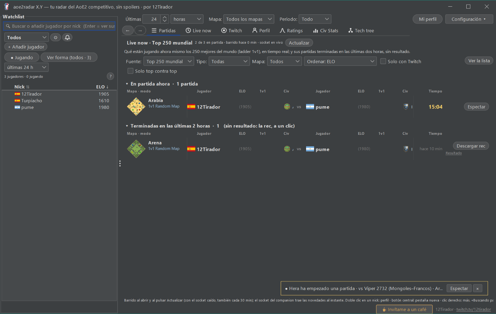
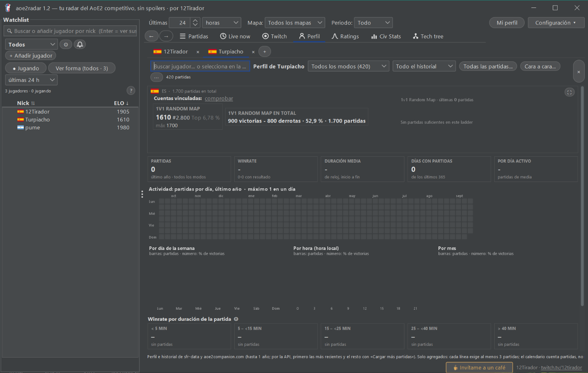
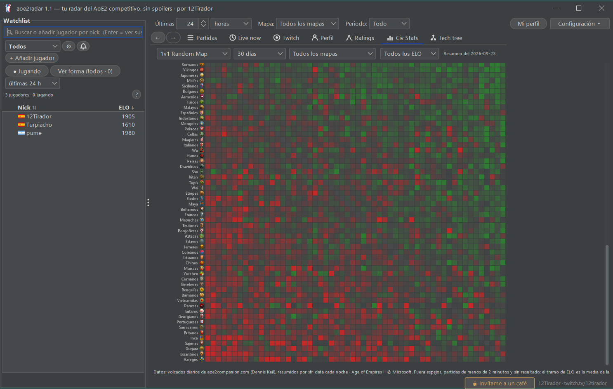

# aoe2radar

Tu radar del Age of Empires II competitivo, sin spoilers.

---

## Español

### Qué es

aoe2radar es una app de escritorio para Windows para Age of Empires II: Definitive Edition.
Sirve para seguir a jugadores y partidas sin enterarte del resultado antes de tiempo.

Incluye:
- Recs (grabaciones de partidas) sin spoilers: descárgalas sin ver antes el resultado.
- Live now: quién está jugando ahora mismo, en directo.
- Perfiles de jugador: actividad, forma reciente, historial.
- Ratings: comparar el ELO de varios jugadores.
- Civ Stats: winrate y uso de civilizaciones.
- Tech tree: árbol tecnológico por civilización.

Los datos vienen de [aoe2companion](https://www.aoe2companion.com) (API y partidas en directo) y de
[aoe2techtree](https://www.aoe2techtree.net). Cada noche, el repositorio `sfr-data` prepara resúmenes y
perfiles ya calculados, para no depender solo de la API en el momento de abrir la app.

### Capturas

| Watchlist y partidas | Live now |
|---|---|
|  |  |

| Perfil de jugador | Civ Stats |
|---|---|
|  |  |

### Instalación

1. Ve a la página de [Releases](https://github.com/jguardiola-dev/aoe2radar/releases/latest) y descarga el
   zip de la última versión.
2. Descomprime el zip en una carpeta propia (no hace falta instalador).
3. Abre `aoe2radar.exe`.
4. Windows puede avisar de que el programa no está firmado («Windows protegió su PC»). Es normal: el
   ejecutable no tiene certificado de firma. Pulsa **Más información** → **Ejecutar de todas formas**.
5. Si vienes de una versión anterior y quieres conservar tu configuración y tu lista de jugadores: copia
   `config.properties` y `players.txt` de la carpeta antigua a la nueva antes de abrir la app.

El zip lleva su propio runtime de Java: no hace falta instalar nada más. La app tiene español e inglés;
se cambia desde **Configuración**.

### Uso básico

- Añade jugadores a la Watchlist buscándolos por nick.
- Agrúpalos (por ejemplo, por clan o por torneo) para filtrar la lista.
- Busca sus partidas recientes: el resultado queda oculto hasta que lo pides tú.
- Descarga la rec y envíasela al juego con un clic.
- Mira Live now para ver quién de tu lista, o del top mundial, está jugando ahora mismo.
- Abre el perfil de un jugador para ver su actividad, su forma reciente y su historial.
- Compara el ELO de varios jugadores en Ratings.
- Consulta Civ Stats y Tech tree para preparar tus partidas.

### Privacidad

Qué guarda en disco, junto al `.exe`:
- `config.properties`: tus ajustes.
- `players.txt`: tu lista de jugadores seguidos.
- `recs/`: las grabaciones de partidas que descargas (y un `descargas.log` con el historial de descargas).
- `sfrdata/`: cachés locales (perfiles, ladder, tech tree, civ stats) para no volver a descargar lo mismo.
- Si pides «Enviar al juego», copia la rec a la carpeta `savegame` de tu perfil de Age of Empires II DE.

A qué servicios se conecta automáticamente:
- **aoe2companion** (`data.aoe2companion.com`, el socket `socket.aoe2companion.com`,
  `api.aoe2companion.com/twitch/live` y `cdn.aoe2companion.com`): partidas, Live now, perfiles, el listado
  de canales de Twitch y las imágenes de mapas.
- **aoe.ms**, del propio Age of Empires II, para descargar las recs.
- **aoe-api.worldsedgelink.com** (World's Edge/Microsoft), para saber si tienes una partida propia en curso.
- **steamcommunity.com**, para el historial de nombres anteriores de un jugador (solo su Steam ID, ya
  público).
- **Twitch** (`static-cdn.jtvnw.net`), para las miniaturas de los canales en directo.
- **GitHub** (`raw.githubusercontent.com`, `api.github.com`): los resúmenes nocturnos de `sfr-data`, el
  árbol tecnológico de `aoe2techtree` y el aviso de versión nueva.

Algunos menús abren enlaces en tu navegador solo si haces clic (perfil en aoe2companion o en aoe2insights,
tu canal de Twitch, el enlace de «Invítame a un café»): esos no los abre la app por su cuenta.

aoe2radar no pide cuenta de usuario, no tiene analítica ni telemetría y no envía datos personales a nadie.

### Créditos

- Datos de partidas y perfiles: **aoe2companion**, de Dennis Keil.
- Árbol tecnológico: **aoe2techtree**, de HSZemi (licencia MIT).
- Banderas: [hampusborgos/country-flags](https://github.com/hampusborgos/country-flags) (dominio público).
- Interfaz: **FlatLaf** (licencia Apache 2.0).
- Runtime incluido en el zip: **OpenJDK** (licencia GPLv2 con excepción de classpath).
- Espectación de partidas: **CaptureAge**.
- Directos: **Twitch**.

Age of Empires II © Microsoft Corporation. aoe2radar se creó siguiendo las «Game Content Usage Rules» de
Microsoft, usando recursos de Age of Empires II; no está avalado ni afiliado por Microsoft.

### Licencia

El código de aoe2radar es software libre bajo licencia MIT: ver [LICENSE](LICENSE).

### Para desarrolladores

Si quieres compilar el proyecto, entender su arquitectura o contribuir, empieza por
[docs/README_TECNICO.md](docs/README_TECNICO.md) (cómo compilar y probar) y
[docs/ARQUITECTURA.md](docs/ARQUITECTURA.md) (plan de migración y capas). En resumen:

```
mvn -q -DskipTests compile      # compila
.\verificar.ps1 -Rapido         # tests, sin pantalla
.\verificar.ps1                 # tests + harness de capturas (no toques el ratón mientras corre)
mvn -Pempaquetar -DskipTests package   # genera el .exe (jpackage)
```

### Autor

Jorge «12Tirador» Guardiola — [twitch.tv/12tirador](https://twitch.tv/12tirador)

---

## English

### What is it

aoe2radar is a Windows desktop app for Age of Empires II: Definitive Edition.
It helps you follow players and matches without spoiling the result before you're ready.

It includes:
- Spoiler-free recs (recorded games): download them without seeing the result first.
- Live now: who is playing right now, live.
- Player profiles: activity, recent form, match history.
- Ratings: compare ELO across several players.
- Civ Stats: civilization winrate and pick rate.
- Tech tree: technology tree per civilization.

Data comes from [aoe2companion](https://www.aoe2companion.com) (API and live matches) and from
[aoe2techtree](https://www.aoe2techtree.net). Every night, the `sfr-data` repository prepares ready-made
summaries and profiles, so the app does not depend only on live API calls when you open it.

### Screenshots

| Watchlist and matches | Live now |
|---|---|
|  |  |

| Player profile | Civ Stats |
|---|---|
|  |  |

### Installation

1. Go to [Releases](https://github.com/jguardiola-dev/aoe2radar/releases/latest) and download the zip for
   the latest version.
2. Unzip it into its own folder (no installer needed).
3. Open `aoe2radar.exe`.
4. Windows may warn that the program is not signed ("Windows protected your PC"). This is expected: the
   executable has no signing certificate. Click **More info** → **Run anyway**.
5. If you're upgrading from an older version and want to keep your settings and player list: copy
   `config.properties` and `players.txt` from the old folder into the new one before opening the app.

The zip bundles its own Java runtime: nothing else to install. The app supports Spanish and English;
switch it from **Configuración** (Settings).

### Basic usage

- Add players to the Watchlist by searching their nickname.
- Group them (for example, by clan or by tournament) to filter the list.
- Search their recent matches: the result stays hidden until you ask for it.
- Download the rec and send it straight to the game with one click.
- Check Live now to see who from your list, or from the world top, is playing right now.
- Open a player's profile to see their activity, recent form and match history.
- Compare ELO across several players in Ratings.
- Check Civ Stats and Tech tree to prepare your games.

### Privacy

What it stores on disk, next to the `.exe`:
- `config.properties`: your settings.
- `players.txt`: your followed players list.
- `recs/`: the recorded games you download (plus a `descargas.log` download history).
- `sfrdata/`: local caches (profiles, ladder, tech tree, civ stats) to avoid downloading the same data twice.
- If you use "Send to game", it copies the rec into the `savegame` folder of your Age of Empires II DE profile.

What it connects to automatically:
- **aoe2companion** (`data.aoe2companion.com`, the `socket.aoe2companion.com` socket,
  `api.aoe2companion.com/twitch/live` and `cdn.aoe2companion.com`): matches, Live now, profiles, the list
  of Twitch channels and map images.
- **aoe.ms**, Age of Empires II's own service, to download recs.
- **aoe-api.worldsedgelink.com** (World's Edge/Microsoft), to tell whether you have a match of your own
  running.
- **steamcommunity.com**, for a player's previous nickname history (using their already-public Steam ID).
- **Twitch** (`static-cdn.jtvnw.net`), for live-channel thumbnail images.
- **GitHub** (`raw.githubusercontent.com`, `api.github.com`): the nightly `sfr-data` summaries, the
  `aoe2techtree` data, and the new-version check.

Some menus open links in your browser only when you click them (a player's aoe2companion or aoe2insights
page, their Twitch channel, the "buy me a coffee" link): the app never opens those on its own.

aoe2radar does not require a user account, has no analytics or telemetry, and does not send personal data
to anyone.

### Credits

- Match and profile data: **aoe2companion**, by Dennis Keil.
- Technology tree: **aoe2techtree**, by HSZemi (MIT license).
- Flags: [hampusborgos/country-flags](https://github.com/hampusborgos/country-flags) (public domain).
- UI: **FlatLaf** (Apache 2.0 license).
- Runtime bundled in the zip: **OpenJDK** (GPLv2 with Classpath Exception).
- Match spectating: **CaptureAge**.
- Streams: **Twitch**.

Age of Empires II © Microsoft Corporation. aoe2radar was created under Microsoft's "Game Content Usage
Rules" using assets from Age of Empires II, and it is not endorsed by or affiliated with Microsoft.

### License

aoe2radar's source code is free software under the MIT license: see [LICENSE](LICENSE).

### For developers

To build the project, understand its architecture, or contribute, start with
[docs/README_TECNICO.md](docs/README_TECNICO.md) (how to build and test) and
[docs/ARQUITECTURA.md](docs/ARQUITECTURA.md) (migration plan and layers). In short:

```
mvn -q -DskipTests compile      # build
.\verificar.ps1 -Rapido         # tests, no screen needed
.\verificar.ps1                 # tests + screenshot harness (don't touch the mouse while it runs)
mvn -Pempaquetar -DskipTests package   # builds the .exe (jpackage)
```

### Author

Jorge «12Tirador» Guardiola — [twitch.tv/12tirador](https://twitch.tv/12tirador)
